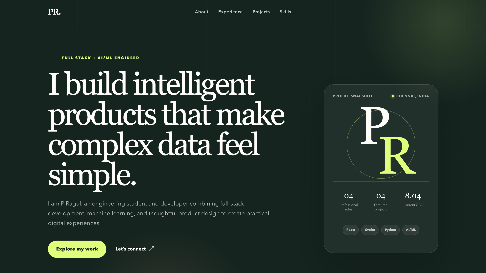

# Resume Template

A clean and professional Resume Template built using HTML and CSS. This project helps users create an attractive and responsive resume that can be customized for job applications, internships, and professional portfolios.

## Live Demo

Add your Vercel deployment link here:

https://resume-template-indol.vercel.app/#skills

## Features

- Professional resume layout
- Responsive design
- Easy to customize
- Clean typography
- Modern user interface
- Print-friendly format

## Technologies Used

- HTML5
- CSS3

## Preview



## Project Structure

```text
resume-template/
├── index.html
├── style.css
├── assets/
├── screenshots/
│   └── resume-template.png
└── README.md
```

## Project Objectives

- Create a professional resume design.
- Practice HTML and CSS layout techniques.
- Build a responsive and printable resume template.
- Improve frontend development skills.

## Learning Outcomes

Through this project, I learned:

- HTML Structure and Semantics
- CSS Styling and Layout
- Responsive Design Principles
- Typography and UI Design
- Professional Portfolio Development

## Customization

You can easily update:

- Personal Information
- Education Details
- Skills
- Projects
- Work Experience
- Contact Information

by editing the content inside `index.html`.


## ⭐ Support

If you found this project useful, consider giving it a star on GitHub.
